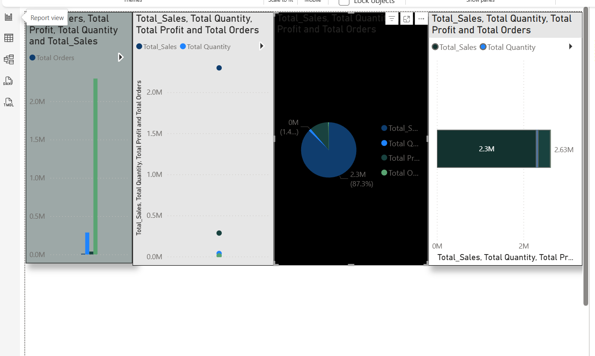

# 🛒 E-Commerce Sales & Customer Analytics with SQL and Power BI  

## 📌 Project Overview

This project demonstrates an end-to-end Data Engineering & Analytics pipeline using Python, PostgreSQL, and Power BI on the popular Sample Superstore dataset (Kaggle).

We clean and split the dataset into customers, products, and orders tables, load them into PostgreSQL, and run SQL queries for business insights such as sales by region, profit by category, and top customers. Finally, we visualize the results in Power BI dashboards.

## 🛠️ Tech Stack

Database: PostgreSQL 17

ETL & Preprocessing: Python (pandas)

Visualization: Power BI

Tools: pgAdmin 4, VS Code, GitHub

## 🗃️ Database Schema

customers → customer_id, customer_name, segment, region, state, postal_code

products → product_id, category, sub_category, product_name

orders → order_id, order_date, ship_date, ship_mode, customer_id, product_id, sales, quantity, discount, profit 

---

## 🗂️ Project Structure  

ecommerce-sales-analytics/
│
├── sql/
│ ├── schema.sql # Database schema (CREATE TABLE statements)
│ ├── load_data.sql # COPY commands to load CSV data
│ └── analytics_queries.sql # Business analytics SQL queries
│
├── data/
│ ├── Sample - Superstore.csv # Raw dataset
│ ├── customers.csv # Cleaned customers table
│ ├── products.csv # Cleaned products table
│ └── orders.csv # Cleaned orders table
│
├── python/
│ └── split_superstore.py # Python script for data cleaning & splitting
│
├── powerbi/
│ └── ecommerce_dashboard.pbix # Power BI dashboard
│
└── README.md # Project documentation

## 🚀 How to Run

1. **Clone the repository**
   ```bash
   git clone https://github.com/palagania/ecommerce-sales-analytics.git
   cd ecommerce-sales-analytics

## 📊 Power BI Dashboard

The final step of this project was to create an **interactive Power BI dashboard** to visualize key business insights such as:

- ✅ Total Sales, Profit, Orders, and Quantity  
- ✅ Profit by Product Category  
- ✅ Top Performing Customers  
- ✅ Regional & Segment-based Analysis  

### 🔗 Dashboard File
You can download and explore the dashboard here:  
[`ecommerce_dashboard.pbix`](powerbi/ecommerce_dashboard.pbix)

## 📊 Dashboard Preview  

Here’s a glimpse of the interactive Power BI dashboard:  


